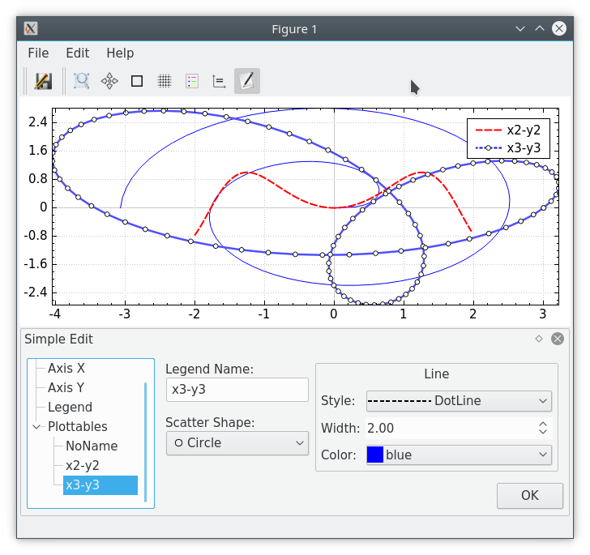
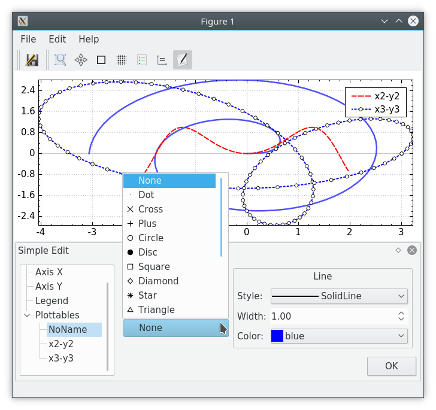

# 简单的绘制二维曲线交互界面
simple front end for 2D curve plot based on QCustomPlot 1

基于[QCustomPlot 1](https://www.qcustomplot.com/release/1.3.2/QCustomPlot.tar.gz)的，可用于C++程序调试过程中，需要显示结果数据看看的情形；包括简单的交互（选择放大、滚轴放大缩小、拖动平移、双击还原、等比例显示等）和简单的编辑（线形、scatter、颜色、title、label、legend等）。


下载[QCustomPlot 1.3.2](https://www.qcustomplot.com/release/1.3.2/QCustomPlot.tar.gz)到当前路径，然后解压
```
tar -xvzf QCustomPlot.tar.gz
```
为了实现一些交互，图方便，之前直接在QCustomPlot源码上改了；修改地方在QCP1.patch中
```
patch -p0 < QCP1.patch
```
然后就可以利用makefile生成了，测试环境Fedora 28和QT 5.10
```
make
```

这里会生成FinWin可执行程序，主函数在[demo.cpp](demo.cpp)中，运行

./FinWin

demo.cpp中列出FigureWindow常见用法，运行结果如图
```
    FigureWindow figWin;
    figWin.plot(x1,y1);
    figWin.holdon();
    figWin.plot(x2,y2,pen1,"x2-y2");
    figWin.plot(x3,y3,pen2,QCPScatterStyle(QCPScatterStyle::ssCircle,pen.color(),Qt::white,6),"x3-y3");

    figWin.show();
```


```
    FigureWindow * figWinP = new FigureWindow;
    figWinP->axisequal();
	figWinP->plot(x5,y5,pen,"x5-y5");
    figWinP->holdon();
    figWinP->plot(x6,y6,pen3,"x6-y6");
	figWinP->setWindowTitle("x5-y5 VS x6-y6 title");
    figWinP->setAxisLabelX("x");
    figWinP->setAxisLabelY("y");

	figWinP->show();
```


```
    FigureSubplotWindow windowSub;
    // windowSub.resize(QSize(740,600));

    windowSub.subplot(0,0);
    windowSub.currentFigure()->plot(x1,y1);
    windowSub.currentFigure()->holdon();
    windowSub.currentFigure()->setTitle("Figure 1");

    windowSub.subplot(0,1);
    windowSub.currentFigure()->plot(x2,y2);
    windowSub.currentFigure()->holdon();
    windowSub.currentFigure()->setTitle("图 2");

    
    windowSub.subplot(1,0);
    windowSub.currentFigure()->plot(x3,y3);
    windowSub.currentFigure()->holdon();
    windowSub.currentFigure()->setTitle("test 3");
    
    windowSub.subplot(1,1);
    windowSub.currentFigure()->setTitle("test 4");
    windowSub.currentFigure()->plotScatters(x4,y4,QCPScatterStyle(QCPScatterStyle::ssCircle,pen,QBrush(Qt::white),6));
    windowSub.currentFigure()->holdon();
    windowSub.currentFigure()->plot(x5,y5);

    windowSub.show();

    windowSub.subplot(1,1);
    windowSub.currentFigure()->axisequal();
```


其它简单编辑界面截图








# License
GPL

icon文件夹下，部分是使用开源项目（oxygen-icons、qwtplot3d等）的图标，使用各自的License
